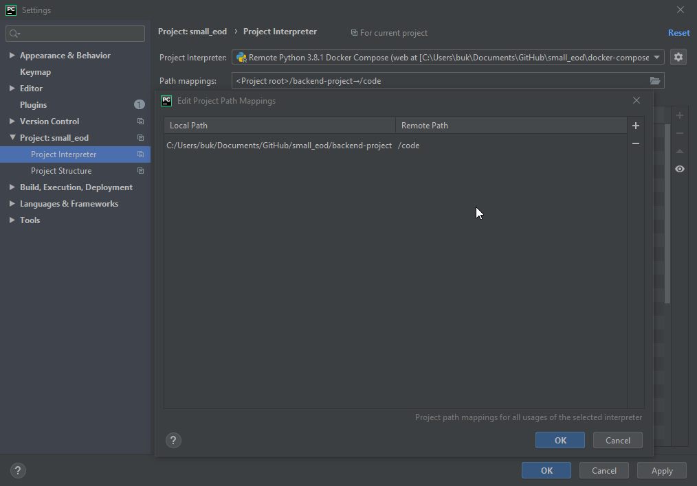
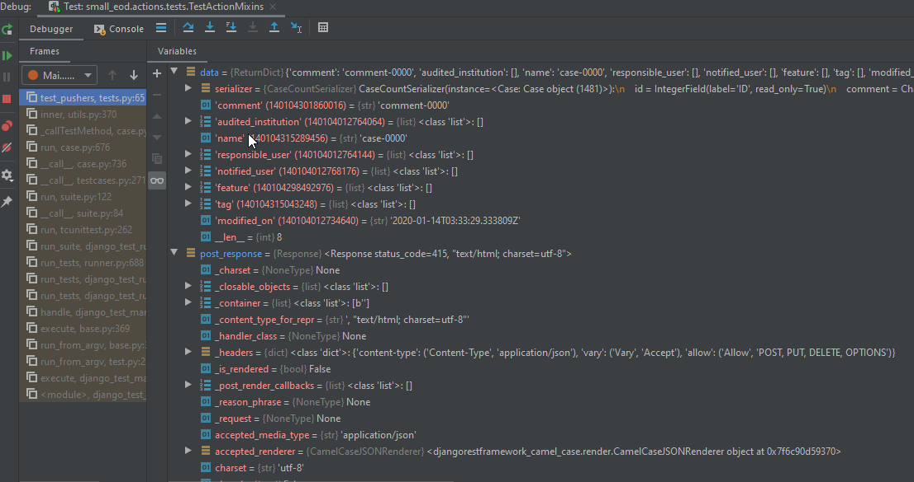

# Small_EOD
 

System służący do usprawnienia obiegu dokumentów Stowarzyszenia, w szczególności w zakresie:

* obiegu korespondencji w zakresie spraw sądowych
* archiwizacji dokumentacji

## Założenia

* system rozwijany będzie małymi etapami, aby jak najszybciej dostarczał wartość dla biura Stowarzysznia
* w początkowych etapach system będzie przeznaczony do archiwizacji dokumentów pochodzących z różnych mediów
* w przyszłości system będzie służył także do:

    * zarządzanie przebiegiem procesu sporządzenia pism
    * powiadamiania o nowych pismach
    * kontroli terminów
    * wysyłkę pism poprzez odpowiednie kolejki:
        * Envelo - realizowane automatycznie
        * ePUAP - realizowane manualnie przez osoby uprawnione, a następnie automatycznie
        * Poczta tradycyjna - realizowane manualnie przez osoby uprawnione

* należy zachować ciągłość funkcjonowania procesów Stowarzyszenia
* system trwale będzie miał charakter wewnętrzny dla Stowarzyszenia
    * publikacja danych z systemu odbywać się będzie poprzez API
* Platforma udostępnia skuteczne API
* Uwierzytelnienie z wykorzystaniem GSuite

## Stan aktualny

* W odrębnym systemie Stowarzyszenie wykorzystuje rejestr korespondencji w dwóch tabelach SQL (przychodzące i wychodzące)

* System umożliwia:

    * rejestracje dokumentów papierowych
    * rejestracje spraw
    
* Panel redakcyjny został wykonany w oparciu o ```django-admin```.

## Pilne zmiany

* Automatyczna rejestracja w dotychczasowym systemie korespondencji
* Opracowanie elastycznego interfejsu użytkownika nie opartego o ```django-grappeli```, w szczególności umożliwiającego:

    * sprawne zarejestrowanie sprawy
    * zarejestrowanie sprawy i jednoczesne wielu archiwalnych listów
    * przesłanie załączników poprzez przeciągnięcie i upuszczenie

 
## Technologia

* Back-end - Django
* Front-end - Vue / React (cokolwiek elastycznego)

Dodatkowe uwagi:

* Projekt Stowarzyszenia korzysta z kontenerów Docker.
* Dodatkowe integracje tj. e-mail, ePUAP, Envelo mogą być odrębnymi usługami, lecz komunikującymi się (microservices)

## Jeżeli chcesz rozwijać projekt

Kod źródłowy projektu można pobrać za pomocą komendy git:
```bash
git clone git@github.com:watchdogpolska/small_eod.git
```
Pracująć na `Windows`/`Mac` dostępny jest [GitHub Desktop](https://desktop.github.com/) - jak z niego skorzystać możesz zobaczyć [tutaj]((/docs/images/githubdesktop.gif)).

### Docker
* W celu szybkiego uruchomienia środowiska wymagany jest [Docker](https://docs.docker.com/install/), a jeśli pracujesz na Linuxie, dodatkowo [docker-compose](https://docs.docker.com/compose/install/). <br>(Docker dla Windows i Mac już go posiada)
* Aby dowiedzieć się więcej o Dockerze zobacz np. https://www.youtube.com/watch?v=P4ZC3cFN0WQ
* W razie problemów bądź pytań otwórz [issue](https://github.com/watchdogpolska/small_eod/issues)

* Cały stack uruchamiany jest za pomocą komendy:
```bash
docker-compose up
```
Po adresem [http://localhost:8000/admin/](http://localhost:8000/admin/) dostępne jest już logowanie z wykorzystaniem loginu i hasła, a wszelkie zmiany plików w lokalnym repozytorium będą automatycznie ładowane przez `Django`.

* Aby utworzyć konto administratora uruchom:
```bash
docker-compose run web python manage.py createsuperuser
```

### Testy
Wszelkie zmiany w repozytorium będą uruchamiały serie testów automatycznych, ale przed ich dodaniem masz możliwość wykonania testów lokalnie za pomocą [Makefile](https://en.wikipedia.org/wiki/Makefile):
* test formatu tekstu
```bash
make lint
```
* testy django
```bash
make test-django-backend
```
* zbudowanie kontenerów
```bash
make build
```
* testowanie backendu django
```bash
make test-django-backend
```

Badź grupowo, wszystkie powyższe:
```bash
make test-local
```

* automatyczne sformatowanie tekstu (np. w przypadku błędów ze strony `make lint`)
```bash
make fmt
```

#### PyCharm
Niezależnie od platformy z uwagi na świętną integrację z [`Dockerem`](https://docs.docker.com/install/) i `Gitem` możliwa jest praca w środowisku [Pycharm](https://www.jetbrains.com/help/pycharm/installation-guide.html#). Automatycznie skonfiguruje on dla Ciebie repozytorium `git` i przełączy pliki na których aktualnie pracujesz (`git checkout`) jednocześnie nie tracąc poprzednich zmian.
 
 Aby skonfigurować Pycharm z naszym środowiskiem, wykonaj poniższe kroki
* Skonfiguruj `remote interpreter` 

W przypadku błędów połączenia z serwerem Dockera upewnij się że konfiguracja TLS dla Dockera jest prawidłowa - jeśli wiesz co robisz, możesz ją po prostu wyłączyć.


* Ustaw `path mappings`

* Zaczekaj aż Pycharm wykona index plików i już za chwilę możesz cieszyć się interaktywnym debuggerem i miłym środowiskiem pracy.

* Możesz również [skonfigurować `default template` dla testów django i zobaczyć jak można pracować z PyCharm](./docs/images/workflow.gif)
